#      **** NCUSCC   2024年秋炒蒜选拔实验报告

实验人：王文博                      专业班级：软件工程2402                  学号：8002124050         

### 一、实验项目名称 

​        c语言排序算法优化

### 二、实验目的

​        在虚拟机中安装 Ubuntu 22.04 LTS 操作系统， 在该系统中实现c语言排序算法，并对比不同优化等级下的排序算法性能表现。

### 三、实验任务

##### 1.安装虚拟机

- 在虚拟机中安装 Ubuntu 22.04 LTS 操作系统。
- 配置虚拟机的网络连接，确保可以正常联网。

#####    2.**安装 C 语言编译器：**

- 安装最新版本的 gcc（可通过 PPA 安装最新稳定版）。
- 验证编译器安装成功，并确保其正常工作。

#####    3.**实现排序算法：**

- 使用 C 语言手动实现以下排序算法：冒泡排序、基础堆排序以及斐波那契堆排序，不调用任何库函数。
- 运行测试代码，确认各排序算法的正确性。

#####    4.**生成测试数据：**

- 编写代码或脚本自动生成测试数据（随机生成浮点数或整数）。
- 测试数据应覆盖不同规模的数据集，其中必须包含至少 100 000 条数据的排序任务。

#####    5.**编译与性能测试：**

- 使用不同等级的 gcc 编译优化选项（如 -O0, -O1, -O2, -O3, -Ofast 等）对冒泡排序和堆排序代码进行编译。
- 记录各优化等级下的排序算法性能表现（如执行时间和资源占用）。

#####    6.**数据记录与可视化：**

- 收集每个编译等级的运行结果和性能数据。
- 分析算法的时间复杂度，并将其与实验数据进行对比。
- 将数据记录在 CSV 或其他格式文件中。
- 使用 Python、MATLAB 等工具绘制矢量图，展示实验结论。

### 四、主要仪器设备及耗材

​       PC，Windows11，VMware，Ubuntu22.04，vscode。

### 五、实验步骤

1.安装VMware


2.下载Ubuntu22.04的ISO镜像文件（在国内的镜像网站上，比如华为云）

3.根据自己电脑配置选择合适的虚拟机配置并创建新的虚拟机（搭载Ubuntu22.04系统），为确保其可以联网，在下图所示的过程中选择NAT选项

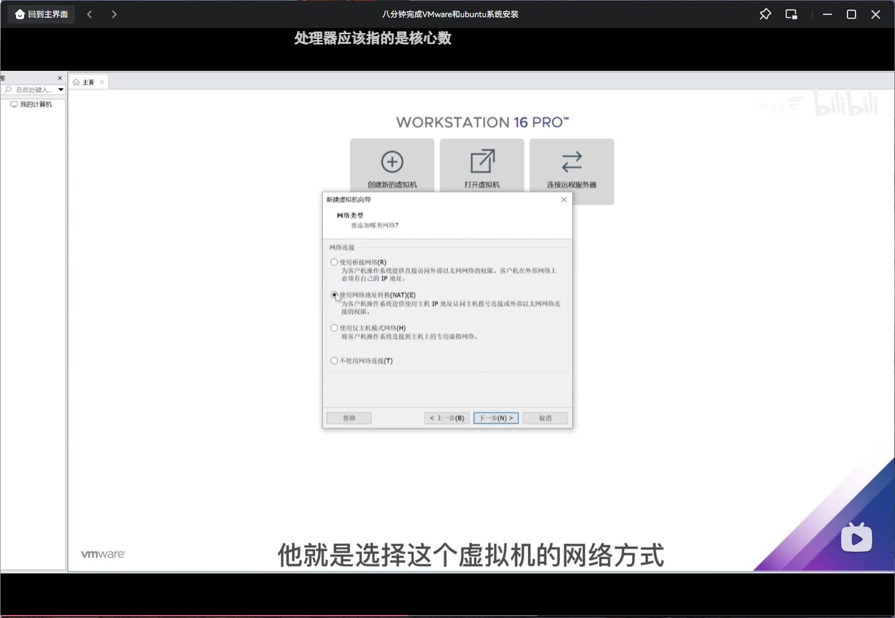

4.创建并安装完成后点击开始此虚拟机即可开始探索Ubuntu的世界

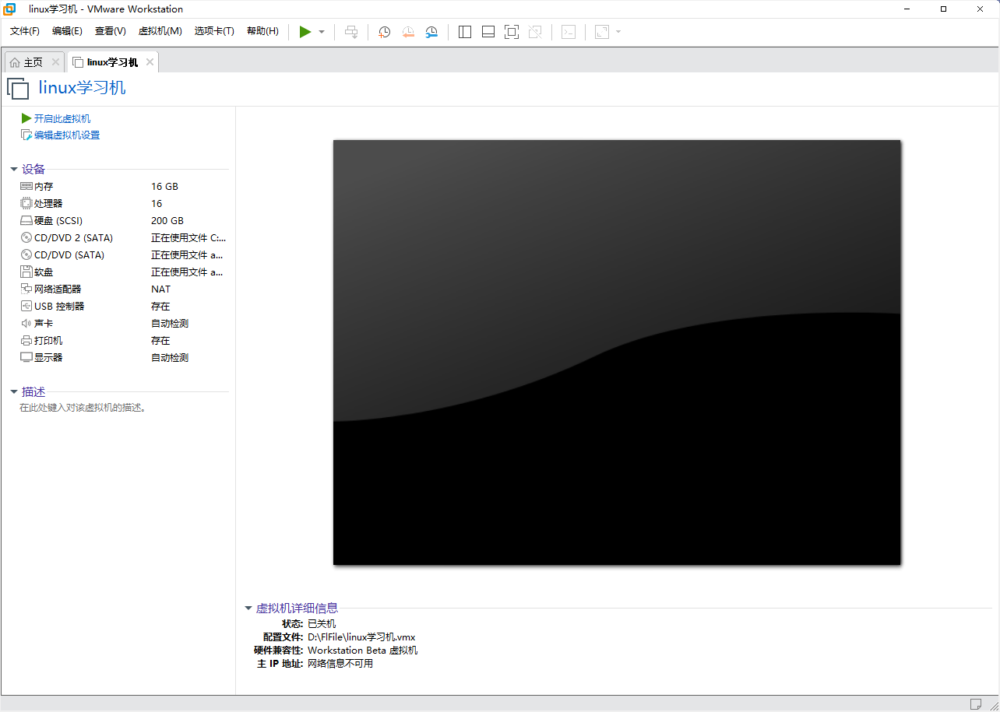

5.在Ubuntu系统中安装vscode，并下载合适的拓展包（如下图）


6.打开终端，输入sudu apt update更新包体

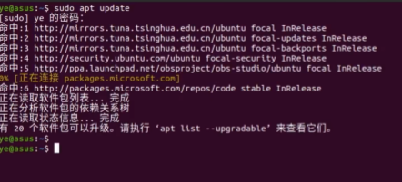

7.输入sudo apt install build-essential gbd

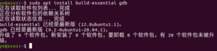

8.验证gcc安装完成后，进入vscode新建文件夹（像我这样的起名懒狗直接起名叫c😋）

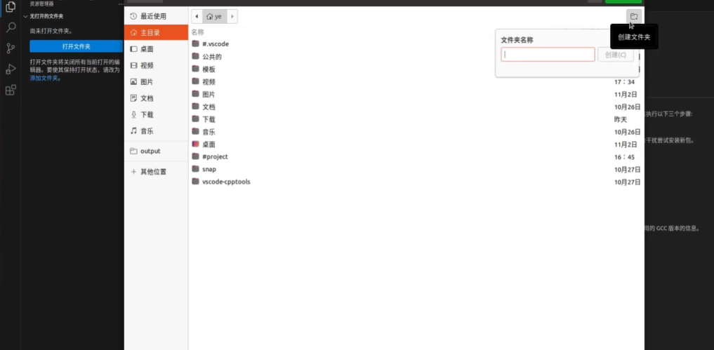

9.配置launch.json文件和tasks.json文件

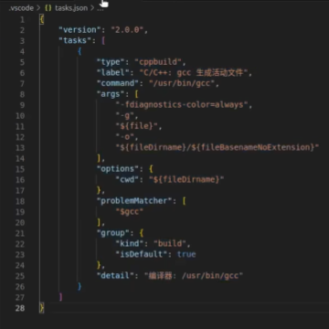

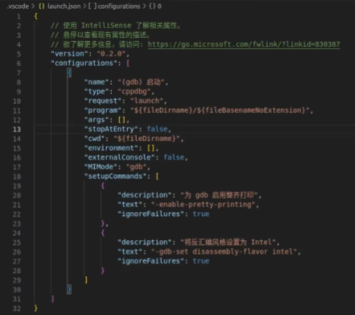

10.新建三个.c文件（bubble_sort.c   heap_sort.c   fib_heap_sort.c)然后开始编写（指剽窃ai工作成果）代码

bubble_sort.c:

```c
#include <stdio.h>
#include <stdlib.h>
#include <time.h>

#define ARRAY_SIZE 1000000

void generateRandomFloatArray(float *array, int size) {
    srand((unsigned int)time(NULL));
    for (int i = 0; i < size; i++) {
        array[i] = (float)rand() / RAND_MAX * 100000.0f;
    }
}

void bubbleSortDescending(float *array, int size) {
    for (int i = 0; i < size - 1; i++) {
        for (int j = 0; j < size - i - 1; j++) {
            if (array[j] < array[j + 1]) {
                float temp = array[j];
                array[j] = array[j + 1];
                array[j + 1] = temp;
            }
        }
    }
}

int main() {
    float array[ARRAY_SIZE];

    // Generate random float array
    generateRandomFloatArray(array, ARRAY_SIZE);

    // Sort the array in descending order
    bubbleSortDescending(array, ARRAY_SIZE);

    // The sorted array is now in 'array', you can process or save it as needed

    return 0;
}
```

heap_sort.c:

```c
#include <stdio.h>
#include <stdlib.h>
#include <time.h>

#define DATA_SIZE 10000000

// 生成随机浮点数数组
void generateRandomFloatArray(float *arr, int size) {
    srand((unsigned int)time(NULL)); // 设置随机数生成的种子
    for (int i = 0; i < size; i++) {
        arr[i] = (float)rand() / RAND_MAX * 1000000.0f; // 生成 0 到 1000000 之间的随机浮点数
    }
}

// 交换两个元素
void swap(float *a, float *b) {
    float temp = *a;
    *a = *b;
    *b = temp;
}

// 堆化函数，确保节点 i 满足最大堆的性质
void heapify(float arr[], int n, int i) {
    int largest = i;
    int left = 2 * i + 1;
    int right = 2 * i + 2;

    // 如果左子节点大于根节点
    if (left < n && arr[left] > arr[largest]) {
        largest = left;
    }

    // 如果右子节点大于当前最大节点
    if (right < n && arr[right] > arr[largest]) {
        largest = right;
    }

    // 如果最大节点不是根节点，交换它们，并继续堆化
    if (largest != i) {
        swap(&arr[i], &arr[largest]);
        heapify(arr, n, largest);
    }
}

// 堆排序函数
void heapSort(float arr[], int n) {
    // 建立最大堆
    for (int i = n / 2 - 1; i >= 0; i--) {
        heapify(arr, n, i);
    }

    // 从堆中提取最大元素，并重新堆化
    for (int i = n - 1; i > 0; i--) {
        // 将堆顶元素（最大值）与最后一个元素交换
        swap(&arr[0], &arr[i]);
        // 减小堆的大小，并重新堆化
        heapify(arr, i, 0);
    }
}

int main() {
    float floatArray[DATA_SIZE];

    // 生成随机浮点数数组
    generateRandomFloatArray(floatArray, DATA_SIZE);

    // 执行堆排序
    heapSort(floatArray, DATA_SIZE);

    // 程序结束，不需要输出
    return 0;
}
```

fib_heap_sort.c:

```c
#include <stdio.h>
#include <stdlib.h>
#include <time.h>

#define DATA_SIZE 100000

typedef struct Node {
    double key;
    struct Node *parent;
    struct Node *child;
    struct Node *left;
    struct Node *right;
    int degree;
    int mark;
} Node;

typedef struct {
    Node *min;
    int size;
} FibonacciHeap;

Node* createNode(double key) {
    Node* node = (Node*)malloc(sizeof(Node));
    node->key = key;
    node->parent = NULL;
    node->child = NULL;
    node->left = node;
    node->right = node;
    node->degree = 0;
    node->mark = 0;
    return node;
}

void insert(FibonacciHeap *heap, Node *node) {
    node->left = node->right = node;
    if (heap->min == NULL) {
        heap->min = node;
    } else {
        node->right = heap->min;
        node->left = heap->min->left;
        heap->min->left->right = node;
        heap->min->left = node;
    }
    heap->size++;
}

void cut(Node *x, Node *y) {
    if (y->left == y->right) {
        y->left = y->right = NULL;
    } else {
        if (y->left == x) {
            y->left = x->right;
        }
        if (y->right == x) {
            y->right = x->left;
        }
        x->left->right = x->right;
        x->right->left = x->left;
    }
    x->left = x->right = x;
    x->parent = NULL;
}

void cascadingCut(FibonacciHeap *heap, Node *x) {
    Node *w = x->parent;
    if (w == NULL) return;
    x->mark = 0;
    if (w->mark == 0) {
        w->mark = 1;
    } else {
        w->mark = 0;
        cascadingCut(heap, w);
    }
}

void link(FibonacciHeap *heap, Node *y, Node *x) {
    y->left = y->right = y;
    if (heap->min == NULL) {
        heap->min = y;
    } else {
        y->right = heap->min;
        y->left = heap->min->left;
        heap->min->left->right = y;
        heap->min->left = y;
    }
    y->parent = NULL;
    heap->size++;
    y->degree = 0;
}

void heapify(FibonacciHeap *heap, Node *node) {
    int degree = node->degree;
    Node *arr[100];
    int idx = 0;
    for (Node *x = node->child; x != NULL; x = x->right) {
        arr[idx++] = x;
    }
    for (int i = 0; i < idx; i++) {
        Node *x = arr[i];
        x->parent = NULL;
        x->mark = 0;
        heapify(heap, x);
    }
    Node *largest = node;
    for (int i = 0; i < idx; i++) {
        Node *x = arr[i];
        if (x->key < largest->key) {
            largest = x;
        }
    }
    if (largest != node) {
        cut(largest, node);
        link(heap, largest, node);
    }
}

Node* extractMin(FibonacciHeap *heap) {
    if (heap->min == NULL) return NULL;
    Node *minNode = heap->min;
    Node *child = minNode->child;
    if (child != NULL) {
        child->parent = NULL;
        child->left = child->right = child;
        insert(heap, child);
    }
    if (minNode == minNode->right) {
        heap->min = NULL;
    } else {
        heap->min = minNode->right;
        Node *temp = heap->min->left;
        temp->right = minNode->left;
        minNode->left->left = temp;
        minNode->left->right = heap->min;
        heap->min->left = minNode->left;
    }
    heap->size--;
    return minNode;
}

void fibonacciHeapSort(double *arr, int n) {
    FibonacciHeap heap;
    heap.min = NULL;
    heap.size = 0;
    for (int i = 0; i < n; i++) {
        insert(&heap, createNode(arr[i]));
    }
    for (int i = 0; i < n; i++) {
        Node *minNode = extractMin(&heap);
        if (minNode) {
            arr[i] = minNode->key;
            free(minNode);
        }
    }
}

int main() {
    double arr[DATA_SIZE];
    srand((unsigned int)time(NULL));
    for (int i = 0; i < DATA_SIZE; i++) {
        arr[i] = (double)rand() / RAND_MAX * 1000000.0;
    }

    fibonacciHeapSort(arr, DATA_SIZE);

    return 0;
}
```

11.编写脚本，自动在不同优化等级下运行，并获取如下图所示的关于运行时间的实验数据

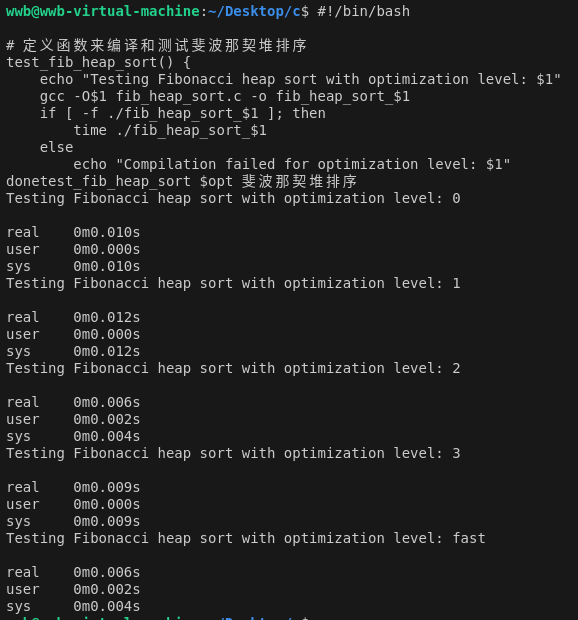

12，修改脚本，转为记录资源使用情况，如下图

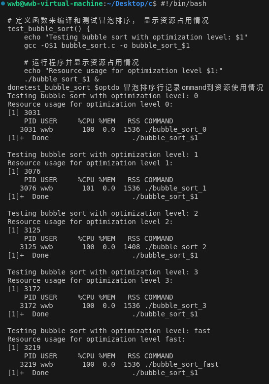

13.统计并记录实验数据

### 六、实验数据及处理结果

在10w排序规模下，三种排序方式的排序用时如下图所示

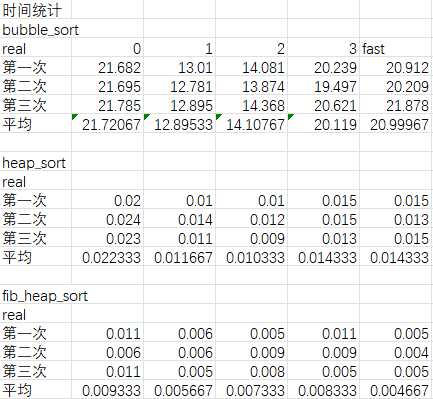

经过可视化处理以后获得以下的图表

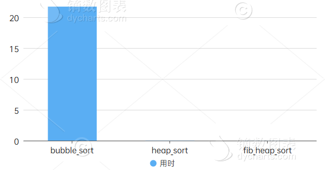

其中体现了bubble_sort在用时方面远远多于另外两种堆排序

而在资源占用方面，bubble_sort也是稳定发挥，在另外两种排序小到无法测量的情况下，cpu占用率拉满且rss占用高达1536kb（看起来好像也不大来着），结合三种排序的时间复杂度来看，bubble_sort这么低下的运行速度确实无愧于它带平方的复杂度

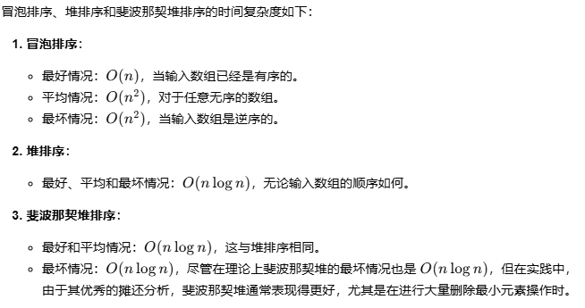

冒泡排序在10w数字规模下的不同优化等级下的表现则如下图所示

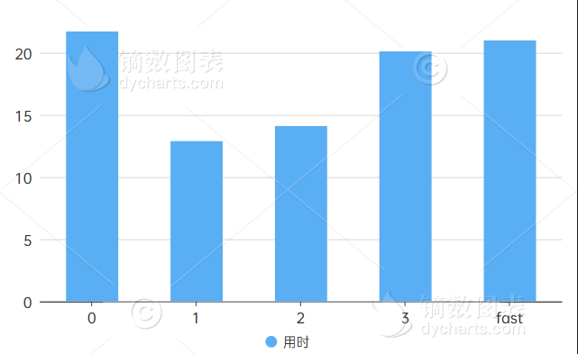

由于10w规模下堆排序和斐波那契堆排序的时间太短，所以决定将规模扩大到十亿级别（这个规模的冒泡排序大概率是跑不出来的叭），于是得到了以下的两张图

heap：

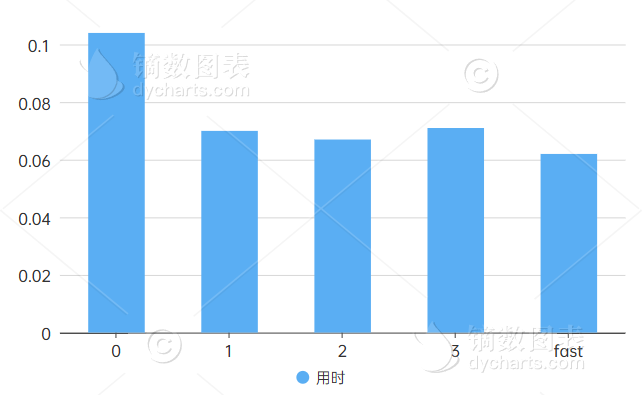

fib_heap:

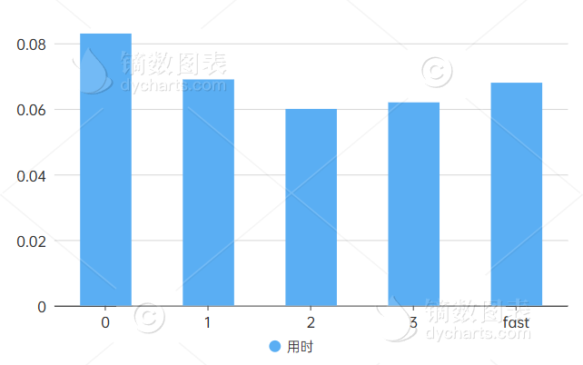


### 七、遇见的问题

​         在实验过程中首先就是遇见了一个特别抽象的问题：忘记了自己装的Ubuntu系统的密码，导致自己卡在了进入界面迟迟无法进入系统。然后就是在编写斐波那契堆排序时由于难度实在太高了，即使在b站上查看了很多视频，也通过浏览器查找了很多学习资料，两天之后依旧没有头绪，最终决定请AI仙人出手，帮我降伏了这难缠的妖精，最后就是在统计实验数据时，编写的自动收集数据的脚本无法正常工作，最终考虑数据不多决定手动统计（悲）

### 八、特别鸣谢

kimi仙人

github.com/shiheat

github.com/HowXu

github.com/olddove-laoge  以及他的锅巴

github.com/ywh555hhh

github.com/JerryYin777


